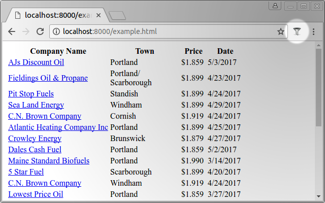
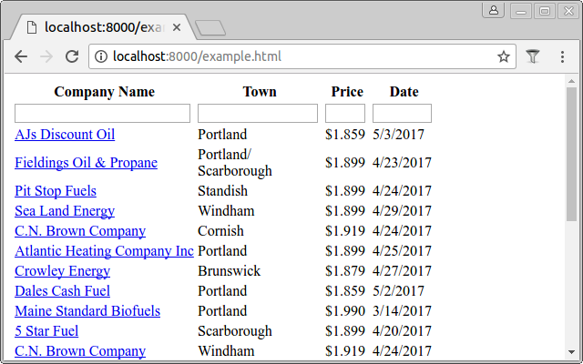
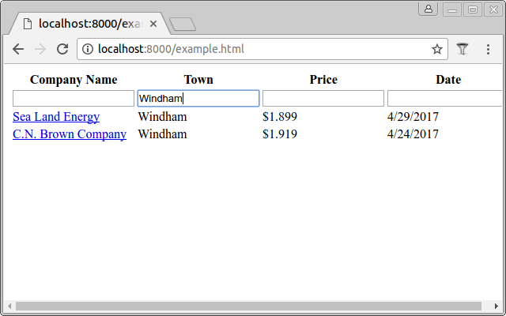

## Tablefilter extension for Chrome

On any page containing a table, click the filter button:

Textboxes will appear on the top of the table:

Type in any textbox to filter the table:

Filters can also be negated by prefixing them with a minus (`-`). To remove all entries in the table which contain `Oil` enter `-Oil`.

## Bookmarklet

Instead of the plugin, you can use [this bookmarklet](bookmarklet.js). Create a new bookmark and copy-paste the contents of this file into it. Then browse to a page containing a table and click your bookmark.
